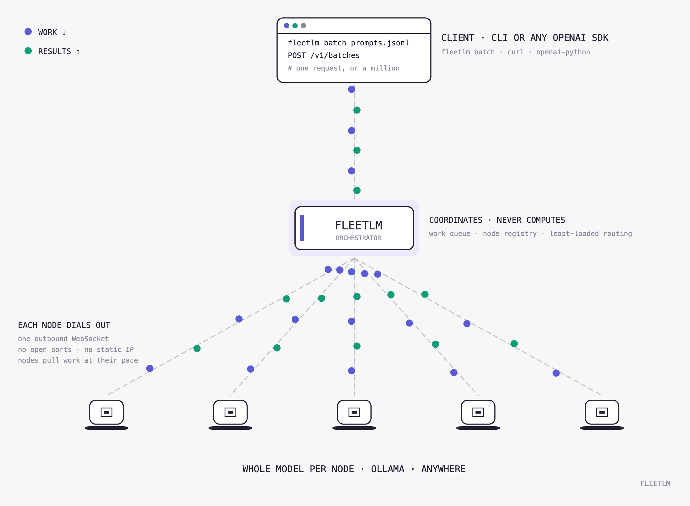

<div align="center">

# FleetLM

**LLM inference served by a fleet of everyday laptops.**

No datacenter GPU anywhere in the serving path.



</div>

---

Idle consumer hardware is the largest under-used compute pool in the world, and LLM inference is memory-bound - a model mostly needs somewhere to *live*. FleetLM turns ordinary Macs into an inference fleet behind one OpenAI-compatible API.

Each node holds a **whole model** in unified memory and dials out over a single WebSocket, so contributors need no open ports, no static IP, and no firewall changes. Work is handed out as small, idempotent units, which makes losing a node a non-event.

**Verified, not asserted:** `kill -9` one node of two during a 24-unit batch and all 24 units still complete - exactly the 4 leases the dead node held get retried, with no client-visible error.

## Quick start

Models come from [Ollama](https://ollama.com), so there is no Python inference stack to install and no repo id to get wrong.

```bash
ollama pull llama3.2      # the model
pip install -e .          # the fleet
fleetlm up                # orchestrator + a local node, one command
```

That prints a dashboard URL and the command another machine would run to join. Then give the fleet some work:

```bash
# prompts.jsonl - one request per line
echo '{"prompt": "Name one primary color."}'  > prompts.jsonl
echo '{"prompt": "Name one fruit."}'         >> prompts.jsonl

fleetlm batch prompts.jsonl -o results.jsonl
```

```
  [########################] 2/2  ok 2  failed 0  running 0  1.9/s  ETA 0m00s
  wrote 2 results to results.jsonl
```

Results land as JSONL in submission order. `fleetlm doctor` reports what this machine can serve; the API is also OpenAI-compatible at `/v1/chat/completions` and `/v1/batches` if you would rather call it directly.

No Mac, or no model? `fleetlm up --engine mock` runs the entire protocol with zero dependencies.

**Across machines**, set a token so only invited nodes can join:

```bash
fleetlm up --token your-secret --port 8080          # on the host
fleetlm join https://your-fleet.example.com --token your-secret   # on each contributor
```

The host needs to be reachable from the internet - a laptop behind NAT needs a tunnel (Cloudflare Tunnel, ngrok, Tailscale) or port forwarding. Nodes never need any of that: they only dial out.

## Three decisions that define it

**Whole models, not sharded layers.** The first design split a model's layers across nodes. That puts a 50-200 ms internet hop inside *every token*, makes every node a single point of failure, and requires the fleet to maintain complete layer coverage at all times. Replicating the whole model on each node removes all three: an 8B model at 4-bit fits in a 16 GB MacBook, nodes become interchangeable, and failure degrades throughput instead of breaking requests. Sharding returns only for models that fit on no single device.

**Batch is the product; interactive is the demo.** Consumer machines on home internet are strong at what batch inference needs - memory, aggregate throughput, and nobody waiting on any single request - and weak at the tight tail latency interactive serving demands. So the fleet's unit of work is one self-contained, idempotent request:

| Event | Consequence |
|---|---|
| Node disconnects | Its leases return to the queue immediately |
| Node hangs, no goodbye | A reaper reclaims the lease after `lease_duration_sec` |
| Duplicate result arrives | Ignored - the first result recorded wins |
| Unit keeps failing | Retried to `max_unit_attempts`, then dead-lettered with its error |

A node does not run those units one at a time. It works its whole lease at once, because decode is memory-bandwidth bound - a step streams the entire weight set out of memory whatever the batch width, so that read amortises across sequences. On MLX that is a single batched pass; on Ollama the daemon runs out of process, so the lease becomes concurrent requests and the width comes from `OLLAMA_NUM_PARALLEL`. Either way a unit that fails still fails alone, and a batch that cannot run falls back to sequential rather than dropping the leases.

**Nodes pull; the orchestrator never pushes.** Each node asks for as much work as it has room for, so a slow laptop simply asks for less. The Python control plane costs 11 µs per work unit - one orchestrator could feed ~36,000 nodes before its own CPU mattered, because 94% of wall-clock is already inside MLX's C++/Metal kernels.

## What works today

| | Status |
|---|---|
| Orchestrator, registry, routing, heartbeat eviction | Working, tested |
| Node agent - Ollama / MLX / llama.cpp / mock engines | Working; Ollama and MLX verified on Apple silicon |
| `fleetlm up` - orchestrator + node in one command | Working, tested |
| `fleetlm batch` - JSONL in, JSONL out, live progress | Working, tested |
| `/v1/chat/completions` - JSON + SSE streaming | Working, tested |
| `/v1/batches` - leased work units, JSONL results | Working, tested against SIGKILL churn |
| Batched decode - a node runs its whole lease in one pass | Working, tested |
| Fleet metrics, join token, `fleetlm doctor` | Working, tested |
| Speedup on 1 laptop vs several | Coming soon (expected to measure) |
| Cost per token | Coming soon (expected to measure) |
| Browser nodes (`/compute`) | Coming soon (expected to test) |

106 tests, no model download and no GPU required. `pytest -q`

## What's next

The goal is a published, reproducible demonstration that a fleet of laptops people already own is a real inference provider. Three steps, in order:

1. **The speedup number** - the same 500 prompts on one laptop and on three, both wall clocks published. Everything here rests on that ratio being real, and it is the one thing still missing.
2. **Cost accounting** - measured energy per million tokens, compared honestly against cloud *batch* pricing.
3. **Output verification** - deciding cheaply whether a result from an untrusted machine can be trusted. This is the open problem for consumer-hardware inference, and the thing that would let a fleet accept strangers rather than only machines you already trust.

Until (3) exists, FleetLM is for **fleets you control** - your own machines, or a team's. Browser nodes and sharding come after.

## Layout

```
orchestrator/   main · protocol · batch · session · metrics · fleet/ · api/
node_agent/     __main__ · engine (ollama|mlx|llama_cpp|mock) · cli
web_compute/    dashboard + contribute page
```

Contributions welcome - see [`CONTRIBUTING.md`](CONTRIBUTING.md). MIT licensed.

## References

FleetLM's architecture was substantially reshaped by Pluralis Research's Stoa run, which demonstrated consumer Macs doing real distributed work over ordinary internet - and, notably, chose whole-model replication over layer sharding for the same hardware class.

1. Miahi, E. *[RL Post-Training on Macs](https://pluralis.ai/blog/rl-post-training-on-macs/)*. Pluralis Research, 2026 - whole-model consumer workers, outbound-only topology, staleness budgets, measurement discipline.
2. Miahi, E., Belilovsky, E. *Understanding and Exploiting Weight Update Sparsity for Communication-Efficient Distributed RL* (PULSE). arXiv:2602.03839.
3. Hannun, A., et al. *[MLX](https://github.com/ml-explore/mlx)* - and `mlx-lm`, one of the node agent's engines.
4. *[Ollama](https://github.com/ollama/ollama)* - the default engine, and why model management is one command instead of a Python install.
5. MLC AI. *[WebLLM](https://github.com/mlc-ai/web-llm)* - the runtime browser nodes will need.
6. Kwon, W., et al. *Efficient Memory Management for LLM Serving with PagedAttention*. SOSP 2023. arXiv:2309.06180.
7. EXO Labs. *[exo](https://github.com/exo-explore/exo)* - prior art for multi-Mac inference (wired; FleetLM's nodes are not).
8. Liquid AI. *[LFM2.5-8B-A1B](https://www.liquid.ai/blog/lfm2-5-8b-a1b)* - the model class consumer fleets suit best.
