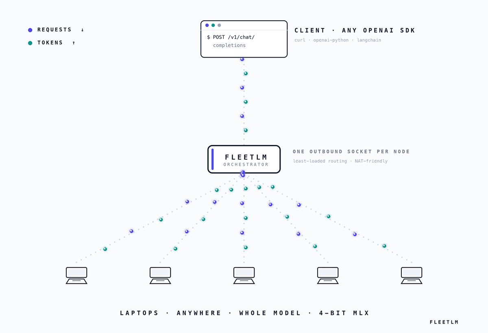

<div align="center">

# FleetLM

**LLM inference served by a fleet of everyday laptops.**

No datacenter GPU anywhere in the serving path.



</div>

---

Idle consumer hardware is the largest under-used compute pool in the world, and LLM inference is memory-bound - a model mostly needs somewhere to *live*. FleetLM turns ordinary Macs into an inference fleet behind one OpenAI-compatible API.

Each node holds a **whole model** in unified memory and dials out over a single WebSocket, so contributors need no open ports, no static IP, and no firewall changes. Work is handed out as small, idempotent units, which makes losing a node a non-event.

**Verified, not asserted:** `kill -9` one node of two during a 24-unit batch and all 24 units still complete - exactly the 4 leases the dead node held get retried, with no client-visible error.

## Quick start

```bash
pip install -e ".[dev]"
pip install mlx-lm                        # real inference on Apple silicon

uvicorn orchestrator.main:app --port 8080 # 1. start the orchestrator
fleetlm join http://localhost:8080        # 2. contribute a machine (new terminal)
```

```bash
# 3. use it - one request, or a whole batch
curl -X POST http://localhost:8080/v1/chat/completions \
  -H "Content-Type: application/json" \
  -d '{"messages":[{"role":"user","content":"Hello"}]}'

curl -X POST http://localhost:8080/v1/batches \
  -H "Content-Type: application/json" \
  -d '{"requests":[{"messages":[{"role":"user","content":"Hello"}]}]}'
```

Dashboard at `/`, fleet numbers at `/metrics`, API docs at `/docs`. No Mac? `fleetlm join <url> --engine mock --model demo` runs the entire protocol with zero dependencies.

**Across machines**, set a token so only invited nodes can join:

```bash
DLLM_JOIN_TOKEN=your-secret uvicorn orchestrator.main:app --host 0.0.0.0 --port 8080
fleetlm join https://your-fleet.example.com --token your-secret
```

## Three decisions that define it

**Whole models, not sharded layers.** The first design split a model's layers across nodes. That puts a 50-200 ms internet hop inside *every token*, makes every node a single point of failure, and requires the fleet to maintain complete layer coverage at all times. Replicating the whole model on each node removes all three: an 8B model at 4-bit fits in a 16 GB MacBook, nodes become interchangeable, and failure degrades throughput instead of breaking requests. Sharding returns only for models that fit on no single device.

**Batch is the product; interactive is the demo.** Consumer machines on home internet are strong at what batch inference needs - memory, aggregate throughput, and nobody waiting on any single request - and weak at the tight tail latency interactive serving demands. So the fleet's unit of work is one self-contained, idempotent request:

| Event | Consequence |
|---|---|
| Node disconnects | Its leases return to the queue immediately |
| Node hangs, no goodbye | A reaper reclaims the lease after `lease_duration_sec` |
| Duplicate result arrives | Ignored - the first result recorded wins |
| Unit keeps failing | Retried to `max_unit_attempts`, then dead-lettered with its error |

A node does not run those units one at a time. It decodes its whole lease in a single batched pass, because decode is memory-bandwidth bound - a step streams the entire weight set out of unified memory whatever the batch width, so that read amortises across sequences. A unit that fails still fails alone, and a batch that cannot run falls back to sequential rather than dropping the leases.

**Nodes pull; the orchestrator never pushes.** Each node asks for as much work as it has room for, so a slow laptop simply asks for less. The Python control plane costs 11 µs per work unit - one orchestrator could feed ~36,000 nodes before its own CPU mattered, because 94% of wall-clock is already inside MLX's C++/Metal kernels.

## What works today

| | Status |
|---|---|
| Orchestrator, registry, routing, heartbeat eviction | Working, tested |
| Node agent - MLX / llama.cpp / mock engines | Working; MLX verified on Apple silicon |
| `/v1/chat/completions` - JSON + SSE streaming | Working, tested |
| `/v1/batches` - leased work units, JSONL results | Working, tested against SIGKILL churn |
| Batched decode - a node runs its whole lease in one pass | Working, tested |
| Fleet metrics, join token, `fleetlm` CLI | Working, tested |
| Browser nodes (`/compute`) | Coming soon (expected to test) |
| Multi-machine fleet | Coming soon (expected to test) |
| Cost per token | Coming soon (expected to test) |

39 tests, no model download required. `pytest -q`

## What's next

The goal is a published, reproducible demonstration that a fleet of laptops people already own is a real inference provider. The two steps that matter most:

1. **Cost accounting** - measured energy per million tokens, compared honestly against cloud batch pricing. This is the number the whole argument rests on.
2. **Output verification** - deciding cheaply whether a result from an untrusted machine can be trusted. The open problem for consumer-hardware inference, and the most interesting thing in the project.

Then a real multi-city fleet run, browser nodes via WebLLM, and sharding last.

## Layout

```
orchestrator/   main · protocol · batch · session · metrics · fleet/ · api/
node_agent/     __main__ · engine (mlx|llama_cpp|mock) · cli
web_compute/    dashboard + contribute page
```

Contributions welcome - see [`CONTRIBUTING.md`](CONTRIBUTING.md). MIT licensed.

## References

FleetLM's architecture was substantially reshaped by Pluralis Research's Stoa run, which demonstrated consumer Macs doing real distributed work over ordinary internet - and, notably, chose whole-model replication over layer sharding for the same hardware class.

1. Miahi, E. *[RL Post-Training on Macs](https://pluralis.ai/blog/rl-post-training-on-macs/)*. Pluralis Research, 2026 - whole-model consumer workers, outbound-only topology, staleness budgets, measurement discipline.
2. Miahi, E., Belilovsky, E. *Understanding and Exploiting Weight Update Sparsity for Communication-Efficient Distributed RL* (PULSE). arXiv:2602.03839.
3. Hannun, A., et al. *[MLX](https://github.com/ml-explore/mlx)* - and `mlx-lm`, the node agent's default engine.
4. MLC AI. *[WebLLM](https://github.com/mlc-ai/web-llm)* - the runtime browser nodes will need.
5. Kwon, W., et al. *Efficient Memory Management for LLM Serving with PagedAttention*. SOSP 2023. arXiv:2309.06180.
6. EXO Labs. *[exo](https://github.com/exo-explore/exo)* - prior art for multi-Mac inference (wired; FleetLM's nodes are not).
7. Liquid AI. *[LFM2.5-8B-A1B](https://www.liquid.ai/blog/lfm2-5-8b-a1b)* - the model class consumer fleets suit best.
